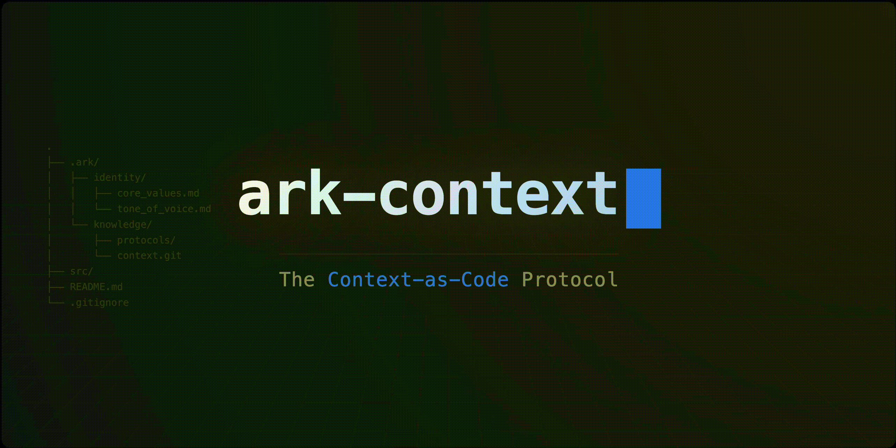

<p align="center">
  
</p>

# Ark-Context
## The Open Protocol for Context-as-Code

> **[🇰🇷 한국어 설명 (Korean Guide)](./README.kor.md)**
>
> This document is written in English for global accessibility. 한국어 설명을 보시려면 위 링크를 클릭해주세요.

---

> **"Don't just build Agents. Build Identities."**
>
> **Ark-Context** is an open-source framework that distills your "Operating System of Thought" into a structured context that AI can understand. Instead of ephemeral chats, build a permanent, evolving knowledge architecture.

---

## 🚀 For Everyone (General)

### Why Ark-Context?
- **Identity Protocol**: A standard way to implant your unique philosophy into any AI.
- **Ownership**: Your context lives on **your** disk, not in a model's cloud.
- **Clarity**: Transforms vague thoughts into a structured "Second Brain."
- **Zero Fatigue**: Stop explaining "who you are" in every new chat. The AI already knows.

### Quick Start (30 Seconds)

**1. Install**
```bash
git clone https://github.com/dev-whitecrow/ark-context.git
cd ark-context
```

**2. Run**
Open this folder in your AI Code Editor (Antigravity, Claude Code, etc.).

**3. Onboard**
Type `/onboarding` in the AI chat. The agent will guide you to build your **Foundation**.

---

## 🛠️ For Engineers (Technical)

### The Architecture: Context-SOLID
We applied software engineering principles to knowledge management.

1.  **SRP (Single Responsibility)**: Each file holds exactly one semantic unit. High token efficiency.
2.  **OCP (Open-Closed)**: **Foundation** is stable; **Execution** is extensible. Layered architecture.
3.  **LSP (Liskov Substitution)**: Semantic checking ensures tactical docs don't violate strategic core values.
4.  **ISP (Interface Segregation)**: AI loads only the relevant context (RAG optimization).
5.  **DIP (Dependency Inversion)**: Metrics (Details) depend on Philosophy (Abstractions), not the other way around.

### The Core Engine: Multi-Agent System
The system is powered by specialized AI agents working in tandem:

1.  **The Architect (Distill Skill)**: Normalizes unstructured `Inbox` data into pure `The_Ark` knowledge.
2.  **The Guardian (Monitoring Skill)**: Enforces logical integrity and detects contradictions.
3.  **The Scribe (Log Skill)**: Immutably records decisions and context for temporal awareness.

### Future Proofing
-   **MCP Ready**: Designed to integrate with Anthropic's Model Context Protocol.
-   **SFT Dataset**: A high-quality, self-supervised dataset for fine-tuning your Personal LLM.
-   **Local First**: 100% private, ensuring security for future On-Device AI.

---

> **Maintained by Project Hur (Whitecrow)**
> "We build the protocol for the AI-Native Era."
